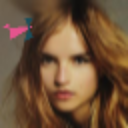
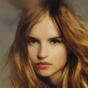
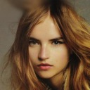
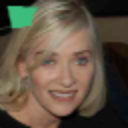
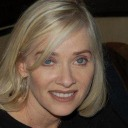

# 📌 Clear Vision: Image Super-Resolution using GANs

<b> Application link </b>: [Clear-Vision](https://clear-vision-pro.streamlit.app/) <br>
<b>Note: Use 64x64(or less than 128x128) pixel images for better results because model upsamples the images to 128x128</b><br>
<b> You can try these Corrupted samples for testing (64x64):</b> [Corrupted](https://drive.google.com/drive/folders/1bzkac88TPpf9ozlXfy3wUcl_Vyu6VxHj?usp=sharing) <br>

## 📄 Overview
This project explores image super-resolution using various GAN architectures:
- *SRGAN* – Super-Resolution Generative Adversarial Network
- *SRWGAN* – Combination of SRGAN with Wasserstein loss

Our goal is to generate high-quality high-resolution (HR) images from low-resolution (LR) inputs, which is critical for applications in surveillance, connected vehicles, and computer vision systems.

### 🧪 Image Corruption Techniques

To test model performance under real-world distortions, the following corruptions were applied to the low-resolution images:

- *Motion Blur*:  
  Simulates camera or object movement during image capture. Achieved by convolving the image with a linear motion kernel, resulting in streaks along the direction of movement.

- *JPEG Compression*:  
  Introduces lossy artifacts due to aggressive compression. Mimics low-quality image storage or transmission by reducing high-frequency details and introducing blocky distortions.

- *Polygon Masking*:  
  Random polygonal regions in the image are masked (covered with black or random pixels). This simulates partial occlusion or sensor failure, forcing the model to infer missing information.

*Corruption Strategies:*

- ✅ 30% of images were corrupted with *all three* techniques.
- ✅ 30% of images were corrupted with *any two* of the three techniques.
- ✅ 30% of images were corrupted with *only one* of the three techniques.
- ✅ The remaining *10% of images* were kept *uncorrupted* for baseline comparison
<br>
<b>Note</b> : For SRGAN and SRWGAN, the original high-resolution images were first downsampled to 64×64 (Low-Resolution), and the models were trained to upsample them by a factor of 2×, generating Super-Resolution outputs of size 128×128.  
 <br> <br>
Each model was tested on corrupted images to assess real-world performance degradation.


## 🚀 Models Used

| Model   | Description |
|---------|-------------|
| *SRGAN*  | Combines pixel-wise loss with perceptual loss using VGG features and adversarial loss to produce photo-realistic images. |
| *SRWGAN* | A hybrid model integrating SRGAN structure with Wasserstein loss for stable training and enhanced visual quality. |

## 🧠 Training Details

- *Dataset*: 10,000 RGB images of size (128×128) [Link](https://www.kaggle.com/datasets/badasstechie/celebahq-resized-256x256)
- *Used 20% for Validation*
- *Training environment*: Kaggle GPU P100
- *Loss Functions*:
  - *Content Loss (MSE)*
  - *Perceptual Loss (VGG)*
  - *Adversarial Loss (BCE for SRGAN, Wasserstein for SRWGAN)*
- *Evaluation Metrics*:
  - PSNR (Peak Signal-to-Noise Ratio)
  - SSIM (Structural Similarity Index)
  - FID SCORE (Fréchet Inception Distance)
  - LPIPS (Learned Perceptual Image Patch Similarity)

## 📊 Results

| Example | Model | LR Image | SR Output | HR Ground Truth |
|--------|--------|----------|-----------|-----------------|
| 1 | SRGAN (64x64 -> 128x128) |  |  |  |
| 2 | SRWGAN (64x64 -> 128x128) |  |  |  |


- *SRWGAN* generated the sharpest and most perceptually realistic images.
- *SRGAN* produced good textures.

### 📊 Evaluation Metrics

| Model   | PSNR ↑ | SSIM ↑ | FID ↓ | LPIPS ↓ |
|---------|--------|--------|-------|---------|
| SRGAN   | 28.01   | 0.90   | 50.34  | 0.0371   |
| SRWGAN  | 28.28   | 0.903   | 42.09  | 0.0364   |

- *↑ Higher is better, **↓ Lower is better*

## 📁 Folder Structure

```
Clear-Vision-Pro/
├── .devcontainer/
│   └── devcontainer.json
├── Architecture and Training/
│   └── Corruption.ipynb
│   └── Dependencies.ipynb
│   └── Inference_latency.ipynb
│   └── Losses.ipynb
│   └── SR-WGAN.ipynb
│   └── SRWgan_training.ipynb
│   └── SRgan.ipynb
│   └── metrics.ipynb
│   └── srgan_train.ipynb
├── __pycache__/
│   └── SRgan.cpython-310.pyc
├── models/
│   └── srgan_model.h5
│   └── srwgan_model.h5
├── utils/
│   └── __pycache__
      │   └── __init__.cpython-310.pyc
      │   └── __init__.cpython-313.pyc
      │   └── image_utils.cpython-310.pyc
      │   └── metrics.cpython-310.pyc
      │   └── model_loader.cpython-310.pyc
      │   └── model_loader.cpython-313.pyc
│   └── __init__.py
│   └── image_utils.py
│   └── metrics.py
│   └── model_loader.py
├── README.md
├── SRgan.py
├── app.py
├── requirements.txt
└── runtime.txt
```

<h2>💻 Tech Stack / Frameworks</h2>

<ul>
  <li><strong>Machine Learning & Image Enhancement:</strong><br>
      <code>TensorFlow</code> – Used to train and run the models that enhance image quality.
  </li>
  <br>
  <li><strong>Web Interface:</strong><br>
      <code>Streamlit</code> – A fast and interactive web app framework used to deploy the Clear Vision interface for uploading images and displaying results.
  </li>
  <br>
  <li><strong>Data Handling:</strong><br>
      <code>NumPy</code>– For efficient data preprocessing, image array manipulation, and metric computation.
  </li>
  <br>
  <li><strong>Visualization:</strong><br>
      <code>Matplotlib</code>– Used to display image quality visually.
  </li>
  <br>
  <li><strong>Image Processing:</strong><br>
       <code>OpenCV</code> – For reading, resizing, and applying filters to images before and after super-resolution.
  </li>
</ul>


## 📚 References

- [SRGAN Paper](https://arxiv.org/abs/1609.04802)
- [WGAN Paper](https://arxiv.org/abs/1701.07875)
